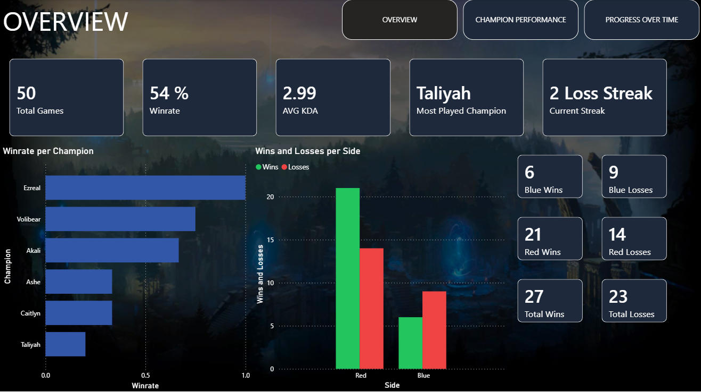
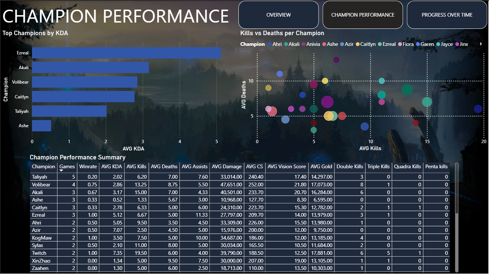
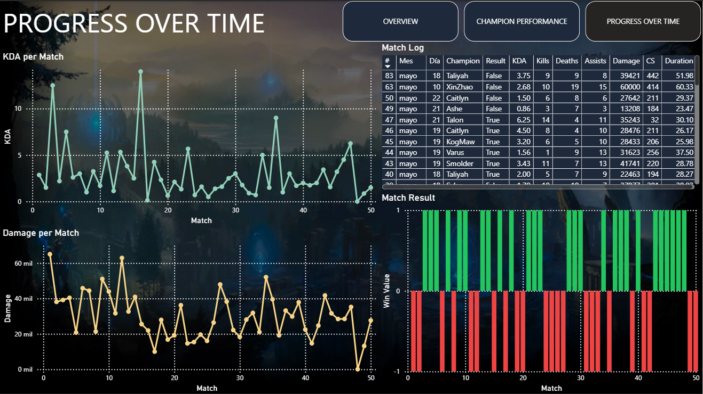

# League of Legends — Solo/Duo Ranked Pipeline

End-to-end data engineering pipeline that extracts, loads, and transforms
Solo/Duo Ranked match data from League of Legends, focused on personal
performance analytics for a single player.

## Tech Stack

| Tool | Purpose |
|---|---|
| Python | Data extraction from Riot Games API |
| PostgreSQL | Data storage (raw + analytics layers) |
| dbt | Data transformation and testing |
| Apache Airflow | Pipeline orchestration |
| Docker | Airflow containerization |
| Power BI | Interactive performance dashboard |

## Pipeline Overview

The pipeline runs daily at 10 AM and consists of three automated tasks:

1. **extract_matches** — Fetches the 50 most recent Solo/Duo Ranked matches
   (queue 420) for the tracked player from the Riot Games API and saves
   them as JSON files.

2. **load_to_postgres** — Parses the raw JSON files and loads them into
   PostgreSQL under the `raw` schema across three tables:
   `matches`, `participants`, and `teams`.

3. **run_dbt** — Executes dbt models to transform raw data into clean,
   player-focused analytics tables under the `analytics` schema.

## Data Models

### Staging Layer (views)
- `staging.stg_matches` — Match metadata with converted timestamps
- `staging.stg_participants` — Player stats with calculated KDA
- `staging.stg_teams` — Team results with side labels (Blue/Red)

### Analytics Layer (tables)
- `analytics.personal_match_history` — One row per match played by the
  tracked player, including champion, result, KDA, damage, CS and
  a chronological match number
- `analytics.personal_champion_stats` — Aggregated stats per champion:
  win rate, avg KDA, avg damage, avg CS, multi-kill totals
- `analytics.personal_overview` — Single-row summary: overall win rate,
  avg KDA, most played champion, best win rate champion, and current
  win/loss streak

## Dashboard

Interactive Power BI dashboard with 3 pages built on top of the
`analytics` schema.

### Overview


### Champion Performance


### Progress Over Time


## Project Structure

```
lol-ranked-pipeline/
├── extraction/          # Riot API extraction scripts
├── loading/             # PostgreSQL loading scripts
├── sql/                 # Schema creation SQL
├── dbt/                 # dbt project (transformations + tests)
│   └── lol_ranked_dbt/
│       ├── models/
│       │   ├── staging/
│       │   └── marts/
│       └── macros/
├── airflow/             # Airflow DAGs and Docker config
│   └── dags/
├── docs/                # Architecture diagram and dashboard screenshots
└── data/                # Raw JSON files (gitignored)
```

## Setup

### Prerequisites
- Python 3.10+
- PostgreSQL
- Docker Desktop
- Riot Games API Key ([developer.riotgames.com](https://developer.riotgames.com))

### Installation

1. Clone the repository
```bash
   git clone https://github.com/VladimirGarcia17/lol-ranked-pipeline.git
   cd lol-ranked-pipeline
```

2. Install Python dependencies
```bash
   pip install requests python-dotenv psycopg2-binary sqlalchemy dbt-postgres
```

3. Configure environment variables
```bash
   cp .env.example .env
   # Edit .env with your credentials
```

4. Create the database schema
```bash
   psql -U postgres -d lol_ranked -f sql/create_raw_schema.sql
```

5. Start Airflow
```bash
   cd airflow
   docker compose up -d
```

6. Access Airflow UI at `http://localhost:8080` and trigger the
   `lol_ranked_pipeline` DAG.

## Key dbt Models

### personal_match_history
Filters `stg_participants` to only the tracked player using a
case-insensitive name match, then joins with `stg_matches` to produce
one row per ranked game with all relevant performance metrics and a
chronological `match_number` column generated with `ROW_NUMBER()`.

### personal_champion_stats
Aggregates `personal_match_history` by champion to produce win rate,
avg KDA, avg damage, avg CS, avg vision score and multi-kill totals.

### personal_overview
Computes a single summary row using multiple CTEs. A `LAG()` window
function detects streak changes by comparing each match result to the
previous one, then assigns streak groups to identify the current
win or loss streak length.

## Related Project

This pipeline is a focused extension of the general LoL match pipeline:
[github.com/VladimirGarcia17/lol-pipeline](https://github.com/VladimirGarcia17/lol-pipeline)

## Author

Vladimir Garcia — [github.com/VladimirGarcia17](https://github.com/VladimirGarcia17)